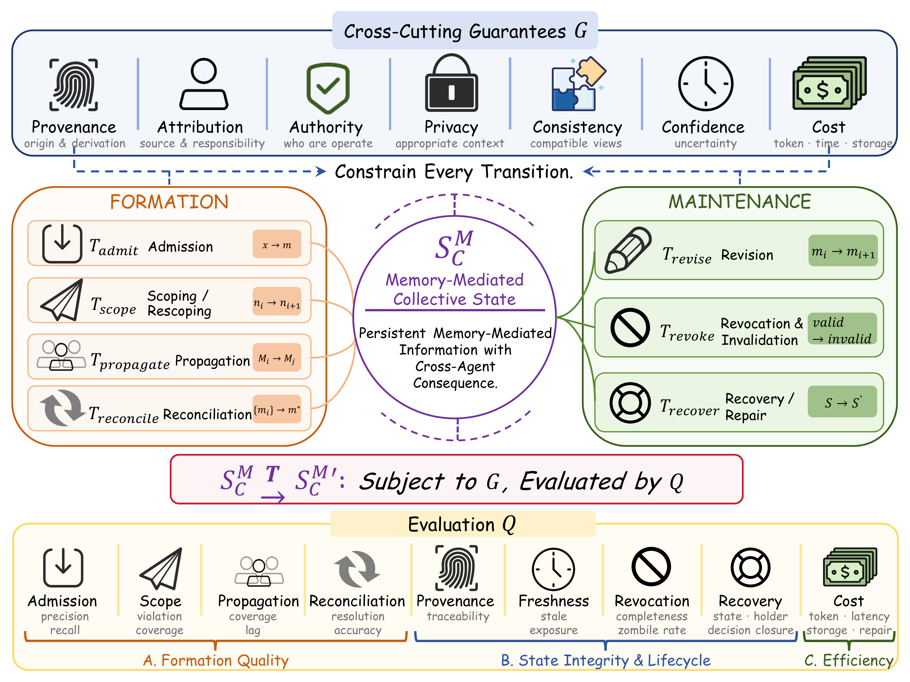
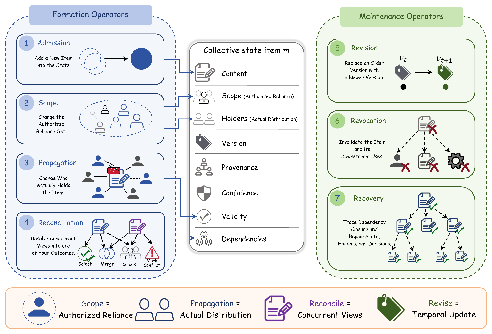
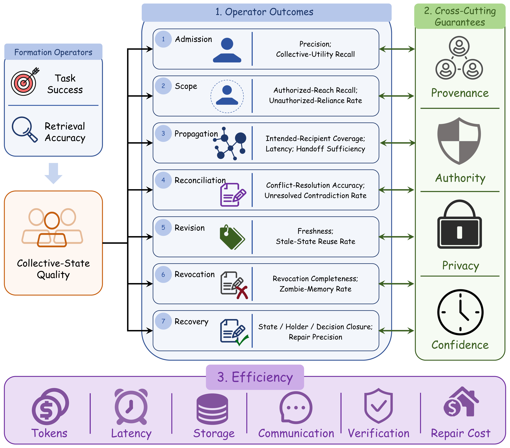
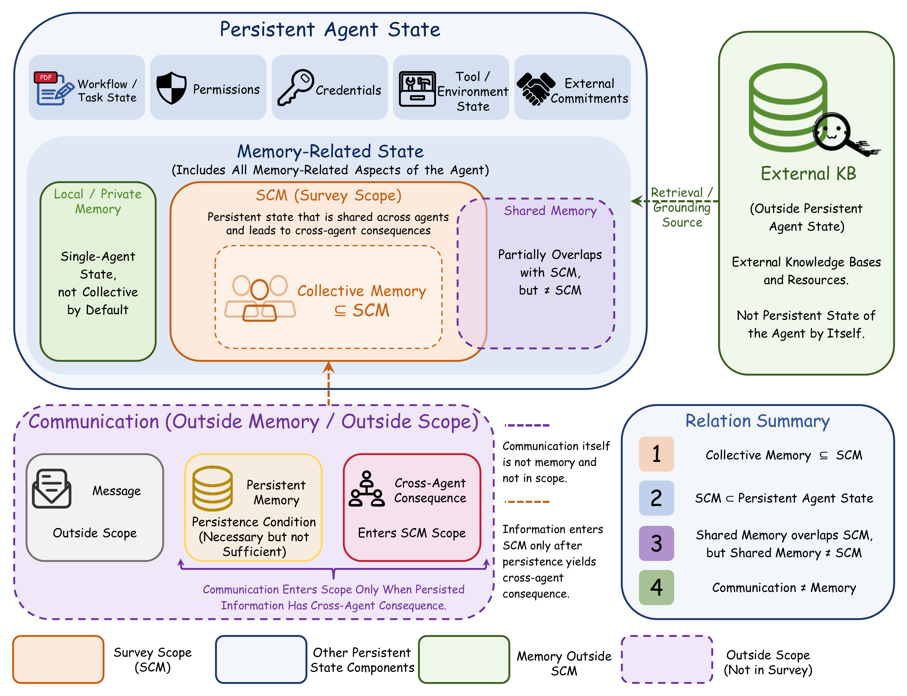

<h1 align="center">From Private Experience to Collective State: A Survey of Multi-Agent Memory Formation and Maintenance</h1>

<p align="center">
  Yiqi Wang, <b>Jiaqi Zhang</b>, Zhangkai Wu, Mingkai Zheng, Zequn Sun, Yiqun Duan, Zirui Liu, Zhihao Hao, Taotao Cai
</p>

<div align="center">
  <a href="https://www.researchgate.net/profile/Yiqi-Wang-42/publication/413963742_From_Private_Experience_to_Collective_State_A_Survey_of_Multi-Agent_Memory_Formation_and_Maintenance"></a>
</div>

## 📌 Contents

- [Overview](#-overview)
- [Why Collective State?](#-why-collective-state)
- [Core Concepts](#-core-concepts)
- [Survey Contributions](#-survey-contributions)
- [OTGE Framework](#-otge-framework)
- [Corpus at a Glance](#-corpus-at-a-glance)
- [Key Findings](#-key-findings)
- [Evaluation](#-evaluation)
- [Research Agenda](#-research-agenda)
- [Survey Roadmap](#-survey-roadmap)
- [Representative Works by Theme](#-representative-works-by-theme)
- [Figures](#-figures)
- [Citation](#-citation)

## 💡 Overview

Research on memory for large language model (LLM) agents is usually organized around representation, storage, retrieval, and use. That framing is useful for a single agent, but it is incomplete for a team. Persistence tells us whether information survives, and an access architecture tells us whether another agent can reach it. Neither tells us whether that agent should rely on the information, who is authorized to rely on it, how disagreements should be resolved, when reliance should stop, or how downstream damage should be repaired.

We call this missing layer the **reliance gap** and shift the unit of analysis from memory stores to the decisions through which agent teams form and maintain persistent collective state.

> **Shared Access ≠ Collective State.** A shared store is neither necessary nor sufficient for a team to have a governed, reliable memory.

<p align="center">
  
</p>

## 🤔 Why Collective State?

Three properties vary independently in an agent team:

| Question | What it establishes |
| --- | --- |
| Does the information survive? | Persistence |
| Can another agent reach it? | Accessibility |
| Should another agent act on it, and for how long? | Governed reliance |

This survey focuses on the third property. It defines **memory-mediated collective state** as persistent, memory-represented information that stands in a cross-agent relation and is collectively consequential:

$$
S_C^M(t)=\{m\mid \mathrm{Persistent}(m)\wedge\mathrm{MemoryMediated}(m)\wedge\mathrm{CrossAgentRelation}(m)\wedge\mathrm{CollectivelyConsequential}(m)\}.
$$

Collective state need not be centralized, globally visible, or identically replicated. It can be maintained through role-scoped digests, handoff summaries, governed shared stores, or divergent per-agent replicas with reconciliation.

## 🤓 Core Concepts

| Concept | Meaning in this survey |
| --- | --- |
| Memory-mediated collective state | Persistent memory-represented information whose use, non-use, or failure affects agents beyond its producer. |
| Shared memory | An access architecture. It overlaps with collective state but does not determine what may be relied upon. |
| Persistent agent state | The broader space that also includes workflow state, permissions, credentials, tool state, and external commitments. |
| Admission | The decision that makes candidate information eligible for collective reuse. |
| Authorized reach | Who may or should rely on an item. |
| Realized reach | Who actually receives or can retrieve the item. |
| Reconciliation | Resolution of divergent views across agents, roles, or replicas. |
| Revision | Temporal change along one informational lineage. |
| Revocation | Withdrawal of the validity or reliance authority of previously admitted state. |
| Recovery | Repair of affected state, holders, and decisions after an error has propagated. |

Six distinctions keep the survey boundary precise:

- **Shared memory ≠ collective state**
- **Scoping ≠ propagation**
- **Reconciliation ≠ revision**
- **Scope restriction ≠ revocation**
- **Collective state ⊂ persistent agent state**
- **Communication ≠ collective-state formation**

## 🎉 Survey Contributions

This survey makes four main contributions:

1. **A framework with defensible boundaries.** It gives a membership criterion for memory-mediated collective state, six non-negotiable distinctions, and an attribute model that makes the seven operators disjoint and comparable.
2. **A coded corpus and a quantitative landscape.** It codes 89 LLM-agent papers on six facets, counting an operator only when a decision is present rather than merely a data structure.
3. **Four conceptual constructs not supplied by the literature.** It develops a collective-utility decomposition, a representation-centered conflict typology, an account of which distributed-systems guarantees transfer to natural-language state, and a three-part model of recovery closure.
4. **A vector-valued evaluation view and evidence-derived agenda.** It proposes nine evaluation dimensions and five research programs derived from operator × guarantee × measurement gaps.

## 🧭 OTGE Framework

The **Object-Transition-Guarantee-Evaluation (OTGE)** framework models collective state as

$$
S_C^M \xrightarrow{\;T\;} {S_C^M}' \quad \text{subject to } G,\ \text{evaluated by } Q.
$$

The operators are composable and non-sequential: a running system can alternate among them and apply several to one item in the same episode.

| Phase | Operator | Core question | Typical failure |
| --- | --- | --- | --- |
| Formation | Admission | Should this become eligible for collective reuse? | Polluted or low-utility memory |
| Formation | Scoping | Who may or should rely on it? | Overexposure, underexposure, or scope drift |
| Formation | Propagation | Who actually receives it? | Missing, delayed, stale, or unauthorized delivery |
| Formation | Reconciliation | What should the group believe? | Persistent or misclassified conflict |
| Maintenance | Revision | How does one informational lineage evolve? | Stale or superseded state reuse |
| Maintenance | Revocation | When should agents stop relying on it? | Zombie memory and incomplete invalidation |
| Maintenance | Recovery | How is propagated damage repaired? | Incomplete state, holder, or decision closure |

Six guarantees constrain these operators:

| Guarantee | Requirement |
| --- | --- |
| Provenance | Preserve a recoverable record of origin, transformation, and propagation. |
| Attribution | Assign an item or responsibility for it to an agent, source, or human principal. |
| Authority | Specify which principal may apply which operator to which item. |
| Consistency | State how agents' views of the same underlying fact are allowed to agree or diverge. |
| Privacy | Prevent reliance outside the item's appropriate context. |
| Confidence | Attach and propagate epistemic uncertainty with the item. |

**Cost is not a seventh guarantee.** Tokens, latency, storage, communication, verifier calls, and repair overhead are charged against every operator as resources consumed.

<p align="center">
  
</p>

## 📊 Corpus at a Glance

The paper conducts a structured curated review covering January 2019 through August 21, 2026. Searches span DBLP, Semantic Scholar, the ACM Digital Library, IEEE Xplore, OpenReview, and arXiv, followed by backward and forward snowballing to closure.

| Corpus statistic | Count |
| --- | ---: |
| Primary coded papers | **89** |
| System papers | 62 |
| Analyses or attacks | 16 |
| Benchmarks | 11 |
| Papers reporting a task metric | 66 |
| Papers reporting a retrieval metric | 14 |
| Papers reporting any collective-state property metric | 31 |
| Papers using a named benchmark | 32 |
| Papers not stating who controls implemented memory operations | 80 |

### Transition coverage

| Operator | Papers | Share of corpus |
| --- | ---: | ---: |
| Admission | 77 | 86.5% |
| Revision | 52 | 58.4% |
| Propagation | 36 | 40.4% |
| Scoping | 25 | 28.1% |
| Reconciliation | 22 | 24.7% |
| Revocation | 12 | 13.5% |
| Recovery | 6 | 6.7% |

### Widest collective scope

| Scope | Papers | Share of corpus |
| --- | ---: | ---: |
| Individual | 48 | 53.9% |
| Team | 23 | 25.8% |
| Organization | 10 | 11.2% |
| Role | 5 | 5.6% |
| Dyadic | 3 | 3.4% |
| Global | 0 | 0.0% |

Operator coding is multi-label, whereas scope is assigned as a single widest level. Foundational pre-LLM work is cited for theory but is not included in the 89-paper coded corpus.

## 🔎 Key Findings

- **Coverage thins by an order of magnitude from formation to repair.** Admission appears in 77 papers, but revocation in only 12 and recovery in 6.
- **The gap is structural, not merely chronological.** Revocation and recovery depend on lineage, validity, scope, and derivation records that must be established while collective state is formed.
- **Shared access does not imply managed reliance.** More than half of the corpus places collective state at individual scope, while global scope appears in no paper.
- **Decision authority is usually silent.** 80 of 89 papers do not state who controls the memory operations they implement.
- **Reconciliation is the sparsest formation operator.** It is studied mainly through concurrency control and analyses of collective-belief failure rather than systems for semantic reconciliation.
- **Evaluation remains outcome-heavy.** Task success and retrieval accuracy can stay unchanged while scope, propagation, provenance, revocation, and recovery quality regress.

### Four constructs introduced by the survey

1. **Collective utility** separates value to the producer from value to the team:

   $$
   U_{\mathrm{team}}(m)=\sum_{j\in A}\pi_j\,[u_j(m)-r_j(m)]-c(m).
   $$

   Here, $u_j$ is the usefulness of item $m$ to agent $j$, $r_j$ is the risk of misapplication, $\pi_j$ weights the relevant audience, and $c(m)$ is the standing cost of maintaining the item.

2. **A seven-type conflict taxonomy** distinguishes factual, semantic, temporal, contextual, policy, role-dependent, and causal/derived conflicts. Temporal, contextual, and role-dependent conflicts are often representation failures rather than genuine disagreements.
3. **A transfer analysis for distributed-systems guarantees** shows that ordering, session guarantees, availability-consistency trade-offs, and concurrency control transfer usefully. Convergence does not transfer without an equality relation over natural-language state; commutative merge fails separately because semantic summarization is order-dependent and non-associative.
4. **Recovery closure** separates whether repair reaches affected state, all holders, and downstream decisions.

## 📐 Evaluation

The survey proposes a nine-dimensional vector instead of a scalar score:

$$
Q(S_C^M)=[Q_{adm},Q_{scope},Q_{prop},Q_{recon},Q_{prov},Q_{revise},Q_{revoke},Q_{recover},Q_{cost}].
$$

| Dimension | Representative measurements |
| --- | --- |
| Admission quality | Admission precision, collective-utility recall, harmful-admission rate |
| Scope quality | Scope accuracy, violation rate, authorized-reach coverage |
| Propagation quality | Coverage, latency, stale exposure, handoff sufficiency |
| Reconciliation quality | Resolution accuracy, contradiction persistence, conflict-type errors |
| Provenance quality | Provenance completeness, attribution fidelity, transformation traceability |
| Revision quality | Freshness, update lag, superseded-state reuse |
| Revocation quality | Revocation completeness, propagation lag, zombie-memory rate |
| Recovery quality | Repair accuracy, state/holder/decision closure, rollback consistency |
| Cost | Tokens, latency, storage, communication, verification, and repair cost |

Three operator-quality quantities highlighted by the survey remain unmeasured in the coded corpus: **collective-utility recall**, **handoff sufficiency**, and **recovery closure**. The corpus likewise reports no direct measure of **repair cost**.

<p align="center">
  
</p>

## ❔ Research Agenda

The operator × guarantee × measurement gaps motivate five research programs:

1. **Dynamic scope and governance** - content-bound enforcement, scope-drift detection, risk-aware promotion, and delegable per-operator authority.
2. **Semantic consistency and transactions** - checkable semantic-consistency predicates, scope-relative guarantees, atomic related writes, and typed conflict resolution.
3. **Provenance, invalidation, and recovery** - provenance that survives compaction, graded dependencies, complete revocation, tombstones, and recovery-closure guarantees.
4. **Minimal coordination and memory-world alignment** - behaviorally sufficient handoff, cost-constrained propagation, effect-linked memory, and compensation after repair.
5. **Benchmarks for collective-state management** - scope transitions, typed conflicts, stale propagation, revocation-repair, and long-horizon organizational scenarios.

## 🗺️ Survey Roadmap

| Section | Focus |
| --- | --- |
| 1 | Introduction and the reliance gap |
| 2 | Scope, definitions, conceptual boundaries, and transition operators |
| 3 | Review protocol, corpus landscape, and coded evidence |
| 4 | Formation: admission, scoping, propagation, and reconciliation |
| 5 | Maintenance: revision, revocation, and recovery |
| 6 | Cross-cutting guarantees and trade-offs |
| 7 | Nine-dimensional evaluation and benchmark gaps |
| 8 | System-level synthesis and five research programs |
| 9 | Conclusion |
| Appendices | Search protocol, coding schema, mechanism tables, extended definitions, guarantee analysis, and full-text recoding |

## 📖 Representative Works by Theme

The 42 works below reproduce the grouping and ordering of the representative paper × transition matrix in Table 4. They are **not** presented as the complete 89-paper corpus. `†` denotes an analysis, attack, or benchmark rather than a system, following the paper's notation.

| Theme | Representative works |
| --- | ---: |
| Single-agent memory substrates | 4 |
| Experience and procedural memory | 5 |
| Multi-agent shared and collaborative memory | 12 |
| Governance layers and memory operating systems | 6 |
| Consistency, concurrency, and collective belief | 6 |
| Temporal validity and versioning | 3 |
| Provenance, repair, and attack | 6 |
| **Total** | **42** |

### Single-Agent Memory Substrates: What Multi-Agent Systems Inherit

| Work | Venue / Year | Focus |
| --- | --- | --- |
| [A-Mem: Agentic Memory for LLM Agents](https://proceedings.neurips.cc/paper_files/paper/2025/hash/19909c36f51abc4856b4560aff3d36d6-Abstract-Conference.html) | NeurIPS 2025 | Agentic-memory design |
| [Mem0: Building Production-Ready AI Agents with Scalable Long-Term Memory](https://arxiv.org/abs/2504.19413) | arXiv, 2025 | Scalable long-term memory |
| [Memory OS of AI Agent](https://aclanthology.org/2025.emnlp-main.1318/) | EMNLP 2025 | Memory operating-system design |
| [Text2Mem: A Unified Memory Operation Language for Memory Operating System](https://aclanthology.org/2026.findings-acl.100/) | Findings of ACL 2026 | Unified memory operations |

### Experience and Procedural Memory

| Work | Venue / Year | Focus |
| --- | --- | --- |
| [Agent Workflow Memory](https://proceedings.mlr.press/v267/wang25bx.html) | ICML 2025 | Workflow-level memory |
| [Memp: Exploring Agent Procedural Memory](https://aclanthology.org/2026.findings-acl.866/) | Findings of ACL 2026 | Procedural memory |
| [What Deserves Memory: Adaptive Memory Distillation for LLM Agents](https://aclanthology.org/2026.acl-long.1607/) | ACL 2026 | Adaptive memory distillation |
| [Adaptive Memory Admission Control for LLM Agents](https://arxiv.org/abs/2603.04549) | ICLR 2026 MemAgents Workshop | Admission control |
| [Memory-R1: Enhancing Large Language Model Agents to Manage and Utilize Memories via Reinforcement Learning](https://aclanthology.org/2026.acl-long.583/) | ACL 2026 | Reinforcement-learning-based memory management |

### Multi-Agent Shared and Collaborative Memory

| Work | Venue / Year | Focus |
| --- | --- | --- |
| [Memory Sharing for Large Language Model Based Agents](https://arxiv.org/abs/2404.09982) | arXiv, 2024 | Memory sharing |
| [Experiential Co-Learning of Software-Developing Agents](https://aclanthology.org/2024.acl-long.305/) | ACL 2024 | Experiential co-learning |
| [G-Memory: Tracing Hierarchical Memory for Multi-Agent Systems](https://proceedings.neurips.cc/paper_files/paper/2025/hash/136a45cd9b841bf785625709a19c6508-Abstract-Conference.html) | NeurIPS 2025 | Hierarchical multi-agent memory |
| [Collaborative Memory: Multi-User Memory Sharing in LLM Agents with Dynamic Access Control](https://arxiv.org/abs/2505.18279) | arXiv, 2025 | Dynamically controlled memory sharing |
| [RCR-Router: Efficient Role-Aware Context Routing for Multi-Agent LLM Systems with Structured Memory](https://arxiv.org/abs/2508.04903) | arXiv, 2025 | Role-aware context routing |
| [MIRIX: Multi-Agent Memory System for LLM-Based Agents](https://arxiv.org/abs/2507.07957) | arXiv, 2025 | Multi-agent memory system |
| [MemIndex: Agentic Event-Based Distributed Memory Management for Multi-Agent Systems](https://doi.org/10.1145/3774946) | ACM Transactions on Autonomous and Adaptive Systems, 2025 | Event-based distributed memory |
| [LLM-Powered Decentralized Generative Agents with Adaptive Hierarchical Knowledge Graph for Cooperative Planning](https://openreview.net/forum?id=l9QUw0oUTa) | AAAI 2025 Workshop on Multi-Agent AI in the Real World | Decentralized knowledge-graph memory |
| [LEGOMem: Modular Procedural Memory for Multi-Agent LLM Systems for Workflow Automation](https://ifaamas.csc.liv.ac.uk/Proceedings/aamas2026/pdfs/VLUA1303.pdf) | AAMAS 2026 Extended Abstracts | Modular procedural memory |
| [ESAA-Conversational: An Event-Sourced Memory Layer for Continuity, Handoff, and Curation Across Heterogeneous LLM Coding Agents](https://arxiv.org/abs/2606.23752) | arXiv, 2026 | Event-sourced continuity and handoff |
| [Multi-Agent Transactive Memory](https://arxiv.org/abs/2606.19911) | arXiv, 2026 | Transactive memory |
| [LatentMem: Customizing Latent Memory for Multi-Agent Systems](https://arxiv.org/abs/2602.03036) | arXiv, 2026 | Latent multi-agent memory |

### Governance Layers and Memory Operating Systems

| Work | Venue / Year | Focus |
| --- | --- | --- |
| † [GateMem: Benchmarking Memory Governance in Multi-Principal Shared-Memory Agents](https://arxiv.org/abs/2606.18829) | arXiv, 2026 | Memory-governance benchmark |
| [Governed Shared Memory for Multi-Agent LLM Systems](https://arxiv.org/abs/2606.24535) | arXiv, 2026 | Governed shared memory |
| † [Governed Collaborative Memory as Artificial Selection in LLM-Based Multi-Agent Systems](https://arxiv.org/abs/2605.04264) | arXiv, 2026 | Governed collaborative memory |
| [MemArchitect: A Policy Driven Memory Governance Layer](https://arxiv.org/abs/2603.18330) | arXiv, 2026 | Policy-driven memory governance |
| [SuperLocalMemory 4.0: The Governed Memory Operating System for AI Agents](https://arxiv.org/abs/2608.08253) | arXiv, 2026 | Governed memory operating system |
| † [Governing Evolving Memory in LLM Agents: Risks, Mechanisms, and the Stability and Safety Governed Memory Framework](https://arxiv.org/abs/2603.11768) | arXiv, 2026 | Stability and safety governance |

### Consistency, Concurrency, and Collective Belief

| Work | Venue / Year | Focus |
| --- | --- | --- |
| [CoAgent: Concurrency Control for Multi-Agent Systems](https://arxiv.org/abs/2606.15376) | arXiv, 2026 | Concurrency control |
| [Verified Detection and Prevention of Concurrency Anomalies in Multi-Agent Large Language Model Systems](https://arxiv.org/abs/2606.17182) | arXiv, 2026 | Verified concurrency-anomaly handling |
| [S-Bus: Automatic Read-Set Reconstruction for Multi-Agent LLM State Coordination](https://arxiv.org/abs/2605.17076) | arXiv, 2026 | Read-set reconstruction |
| † [When Agents "Misremember" Collectively: Exploring the Mandela Effect in LLM-Based Multi-Agent Systems](https://iclr.cc/virtual/2026/poster/10006567) | ICLR 2026 | Collective misremembering |
| † [Emergence of Biased Consensus in Multi-Agent LLM Debates](https://arxiv.org/abs/2608.02827) | arXiv, 2026 | Biased consensus |
| † [When Truth Is Distributed: Misinformation Derails Collective Fact Recovery in LLM-Based Multi-Agent Systems](https://arxiv.org/abs/2608.03421) | arXiv, 2026 | Misinformation and collective fact recovery |

### Temporal Validity and Versioning

| Work | Venue / Year | Focus |
| --- | --- | --- |
| [ChronoMem: Version Control and Semantic Rollback for Large Language Model Agent Memory](https://arxiv.org/abs/2607.27773) | arXiv, 2026 | Version control and semantic rollback |
| † [STALE: Can LLM Agents Know When Their Memories Are No Longer Valid?](https://arxiv.org/abs/2605.06527) | arXiv, 2026 | Memory-validity awareness |
| [Beyond Dialogue Time: Temporal Semantic Memory for Personalized LLM Agents](https://aclanthology.org/2026.findings-acl.1496/) | Findings of ACL 2026 | Temporal semantic memory |

### Provenance, Repair, and Attack

| Work | Venue / Year | Focus |
| --- | --- | --- |
| [MAP-Graph: Provenance-Aware Shared Memory for Multi-Agent Workflows](https://arxiv.org/abs/2608.10509) | arXiv, 2026 | Provenance-aware shared memory |
| [Memory Provenance Laundering in LLM Agents: A Non-Amplification Firewall for Persistent Memory](https://arxiv.org/abs/2607.29167) | arXiv, 2026 | Provenance laundering and containment |
| [Memory Poisoning Propagation and Repair Mechanism in Multi-Agent Collaborative Environments](https://doi.org/10.1145/3806262.3806294) | Proceedings of the 2nd International Conference on Artificial Intelligence, Digital Media Technology and Social Computing, 2026 | Poisoning propagation and repair |
| [Goal-Aware Identification and Rectification of Misinformation in Multi-Agent Systems](https://openreview.net/forum?id=6Y9NP1qhoM) | ICLR 2026 | Misinformation identification and rectification |
| † [Aegis: Automated Error Generation and Attribution for Multi-Agent Systems](https://openreview.net/forum?id=zqcYoxXiN3) | ICLR 2026 | Automated error attribution |
| † [AgentPoison: Red-Teaming LLM Agents via Poisoning Memory or Knowledge Bases](https://doi.org/10.52202/079017-4136) | NeurIPS 2024 | Memory-poisoning attack |

## 🎥 Figures

These are high-resolution PNG exports (300 DPI) of the four vector-PDF figures used in the manuscript. Because the source files are named independently of their order in the paper, manuscript Figures 1–4 correspond to `Figure1.pdf`, `Figure3.pdf`, `Figure2.pdf`, and `Figure5.pdf`, respectively. See the [archived manuscript on Zenodo](https://doi.org/10.5281/zenodo.22288996) for the figures in context.

### Figure 1: Object-Transition-Guarantee-Evaluation Framework

Locally held information becomes memory-mediated collective state through formation operators and is kept valid through maintenance operators. Guarantees constrain every transition, while multidimensional evaluation tests the resulting state.

<p align="center">
  
</p>

### Figure 2: Collective-State Transition Operators

The seven operators transform different attributes of a collective-state item and can be composed in any order.

<p align="center">
  
</p>

### Figure 3: Scope and Conceptual Boundaries

Collective state is a subset of persistent agent state, collective memory is a subset of collective state, and shared memory only partially overlaps with it.

<p align="center">
  
</p>

### Figure 4: Evaluation View

Task success and retrieval accuracy remain necessary, but they are insufficient for measuring formation quality, lifecycle integrity, provenance, and cross-cutting efficiency.

<p align="center">
  
</p>

## 📝 Citation

If you find this survey useful, please consider citing it:

```bibtex
@article{wangprivate,
  author={Yiqi Wang and
          Jiaqi Zhang and
          Zhangkai Wu and
          Mingkai Zheng and
          Zequn Sun and
          Yiqun Duan and
          Zirui Liu and
          Zhihao Hao and
          Taotao Cai},
  title={From Private Experience to Collective State: A Survey of Multi-Agent Memory Formation and Maintenance}
}
